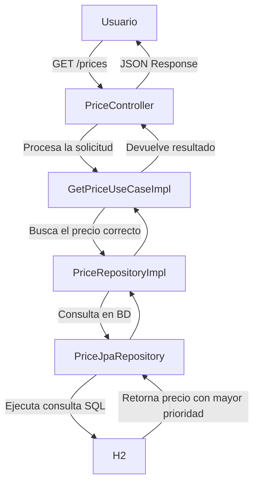
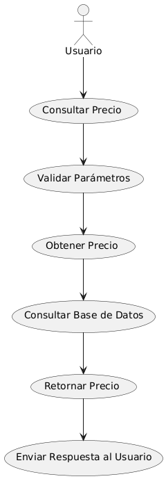

# Proyecto Inditex App

## Descripción

Este proyecto implementa un servicio de gestión de precios basado en Java 17, utilizando H2 como base de datos en
memoria. Se ha desarrollado con Spring Boot y JPA para la gestión de datos.

## Tecnologías Utilizadas:

- **Java 17**: Lenguaje de programación principal.
- **Spring Boot**: Framework para el desarrollo de la aplicación.
- **JPA (Jakarta Persistence API)**: Para la persistencia de datos.
- **H2 Database**: Base de datos en memoria para pruebas y desarrollo.
- **Swagger & OpenAPI**: Documentación de la API y generación automática de controladores y DTOs.
- **Docker & Docker Compose**: Contenerización y orquestación de servicios.

## Arquitectura

Se ha seguido una **arquitectura hexagonal**, donde la lógica de negocio está desacoplada de las interfaces externas
como controladores y persistencia.


## 📂 Estructura del Proyecto

El proyecto sigue una arquitectura **hexagonal (ports & adapters)**, organizada en los siguientes paquetes:

```
com.inditex
│── application
│   ├── caseuse
│   │   └── IGetPriceUseCase.java         # Interfaz del caso de uso 
│   │   └── GetPriceUseCaseImpl.java      # Implementación del caso de uso 
│   ├── mapper
│   │   └── PriceDtoMapper.java           # Mapper para la conversión entre el modelo de dominio y los DTOs
│
│── domain
│   ├── exception
│   │   └── NotFoundException.java       # Excepción personalizada lanzada cuando no se encuentra un recurso
│   ├── repository
│   │   └── PriceRepository.java         # Interfaz que define el puerto de salida para el repositorio de precios
│   ├── model
│   │   └── Brand.java                   # Modelo de dominio que representa la entidad Marca
│   │   └── Currency.java                # Enum de dominio que representa las divisas
│   │   └── Price.java                   # Modelo de dominio que representa un precio
│
│── infrastructure
│   ├── adapter
│   │   └── PriceRepositoryAdapter.java  # Implementación del adaptador para la interfaz de repositorio de precios
│   ├── controller
│   │   └── PriceController.java         # Controlador REST que expone los endpoints para interactuar con los precios
│   ├── exception
│   │   └── GlobalExceptionHandler.java  # Manejador global de excepciones para capturar errores de la API
│   ├── mapper
│   │   └── PriceEntityMapper.java       # Mapper que convierte entre las entidades JPA y los modelos de dominio
│   ├── interceptor
│   │   └── RequestResponseLoggingInterceptor.java  # Interceptor que captura y print log las peticiones y respuestas
│   │   └── WebConfig.java              # Configuración del interceptor para ser registrado en el contexto de Spring
│   ├── repository
│   │   ├── entity
│   │   │   └── BrandEntity.java        # Entidad JPA que mapea la tabla de Marca
│   │   │   └── Currency.java           # Enum JPA que mapea el tipo de moneda
│   │   │   └── PriceEntity.java        # Entidad JPA que mapea la tabla de Precios
│   │   ├── jpa
│   │   │   └── PriceJpaRepository.java # Implementación del repositorio JPA que interactúa con la base de datos
│
│── InditexApp.java                      # Clase principal que inicia la aplicación Spring Boot

```

## 🔄 Flujo de Procesamiento de Consulta de Precios



## 🔄 Flujo de Consulta de Precios



## Documentación

La API está documentada con **Swagger** y **OpenAPI**, permitiendo la generación automática de los controladores y DTOs.

### Endpoints:

1. **Consulta de Precios**

   Este endpoint permite obtener los precios de un producto en una fecha y hora específica, de acuerdo con
   el `productId` y `brandId` proporcionados.

   **URL**:
   `GET /prices`

   **Parámetros de consulta:**

   | Parámetro       | Tipo     | Requerido | Descripción |
         |---------------|---------|----------|-------------|
   | applicationDate | String  | Sí       | Fecha y hora en formato `YYYY-MM-DDTHH:MM:SS` |
   | productId      | Integer | Sí       | ID del producto |
   | brandId        | Integer | Sí       | ID de la marca |

   **Ejemplo de solicitud:**
   ```http
   GET http://localhost:8080/prices?applicationDate=2025-06-14T15:01:00&productId=35455&brandId=1
   ```

   **Ejemplo de respuesta:**
   ```json
    {
        "productId": 35455,
        "brandId": 1,
        "priceList": 2,
        "startDate": "2025-06-14T15:00:00",
        "endDate": "2025-06-14T18:30:00",
        "price": 25.45
    }
   ```
   
## Ejecución Local

Para ejecutar el proyecto localmente, asegúrate de tener instalado **Java 17, Maven y Docker**.

### Pasos para ejecutar el proyecto:

1. Compila el proyecto con:
   ```sh
   mvn clean package
   ```
2. Ejecuta la aplicación:
   ```sh
   java -jar target/ms-price-1.0.0.jar
   ```
3. Accede a los servicios en local:
    - [Swagger UI](http://localhost:8080/swagger-ui/index.html)
    - [Consulta de precios en local](http://localhost:8080/prices?applicationDate=2025-06-14T15:01:00&productId=35455&brandId=1)

## Configuración de Docker Compose

Archivo `docker-compose.yml`:

```yaml
version: "3.8"

services:
   app:
      build: .
      container_name: ms-price
      ports:
         - "8080:8080"
```

Este archivo define tres servicios:

- **app**: Contenedor de la aplicación Spring Boot.

Para verificar que los servicios están corriendo, puedes ejecutar:

```sh
docker ps
```

Para detener los servicios:

```sh
docker-compose down
```

Para levantar los servicios, ejecutar:

```sh
docker-compose up -d
```

Dockerfile para aplicación:

```dockerfile
FROM openjdk:17-jdk-slim

WORKDIR /app

COPY target/ms-price-1.0.0.jar app.jar

EXPOSE 8080

ENTRYPOINT ["java", "-jar", "app.jar"]

```